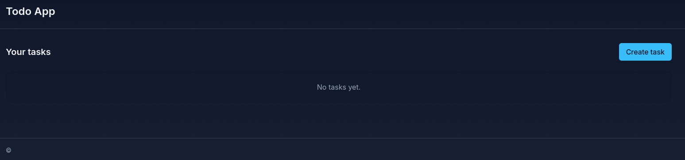

# 01_todo_app — Todo App

Lightweight Django Todo application (server-rendered) with Tailwind CSS for styling.

This README covers how to run the project locally, build the frontend assets (Tailwind), and includes example screenshots/GIFs placed in the `img/` and `gif/` folders.

---

## Project layout (important files)

- `manage.py` — Django management entrypoint
- `todo_app_django/` — Django project package (settings, urls, wsgi, asgi)
- `tasks/` — Django app implementing the todo model, views, templates and tests
- `templates/` — Project-level templates (base, home, registration)
- `static/` — Static assets. Generated Tailwind CSS is written to `static/css/tailwind.css`
- `src/css/input.css` — Tailwind input that is compiled to `static/css/tailwind.css`
- `package.json`, `postcss.config.cjs`, `tailwind.config.cjs` — Tailwind/PostCSS build pipeline
- `.venv/` — Python virtual environment (recreated in this workspace)

Optional folders you can place visual assets in (add them if they don't already exist):

- `img/` — screenshots (PNG/JPG) — for example `img/screenshot.png`
- `gif/` — animated GIFs demonstrating UI flows — for example `gif/demo.gif`

---

## Quick start (development)

1. Open a terminal in the project root (this README assumes you're in `01_todo_app`).

2. Create / activate the Python venv (if it doesn't exist):

```bash
# create venv (only if .venv is missing)
python3 -m venv .venv
source .venv/bin/activate

# upgrade pip and install Django if needed
python -m pip install --upgrade pip
pip install -r requirements.txt  # if you maintain one; otherwise install django
pip install django
```

3. Install Node dependencies (Tailwind + PostCSS). This project uses the npm scripts in `package.json`.

```bash
npm install
# build tailwind CSS once
npm run build:css
# or watch during development
npm run dev:css
```

4. Apply Django migrations and run the dev server:

```bash
python manage.py migrate
python manage.py runserver 0.0.0.0:8000
```

5. Open the app in your browser at:

```
http://localhost:8000/
```

---

## Creating demo users & tasks

The app is intentionally simple and by default runs without authentication. You can create tasks directly from the UI. If you need a demo user for admin access:

```bash
# create a superuser (interactive)
python manage.py createsuperuser

# or create a quick user non-interactively
echo "from django.contrib.auth import get_user_model; User = get_user_model(); User.objects.create_superuser('admin','admin@example.com','adminpass')" | python manage.py shell
```

Then visit the admin at `/admin/`.

---

## Tailwind build notes

Tailwind and PostCSS are used to generate `static/css/tailwind.css` from `src/css/input.css`.
- `npm run build:css` — build once (production-ready with `--minify` configured in the script)
- `npm run dev:css` — watch mode for development

A `postinstall` npm script is configured to run `build:css` after `npm install`.

If you add or change templates, re-run `npm run build:css` so Tailwind's purging picks up the classes used in your templates.

---

## Testing

Run Django tests with:

```bash
source .venv/bin/activate
python manage.py test
```

The repository includes model tests for the core `Task` behavior.

---

## Screenshots and GIFs




---

## Deployment notes

- For production, build the CSS in CI and run `python manage.py collectstatic` as part of the deploy.
- Serve static files from a CDN or S3 and run Django under a proper WSGI/ASGI server (Gunicorn/Uvicorn) behind a reverse proxy.

